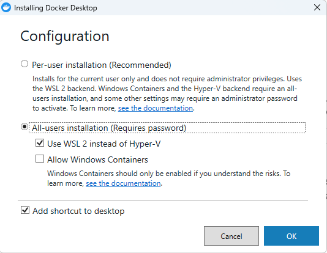
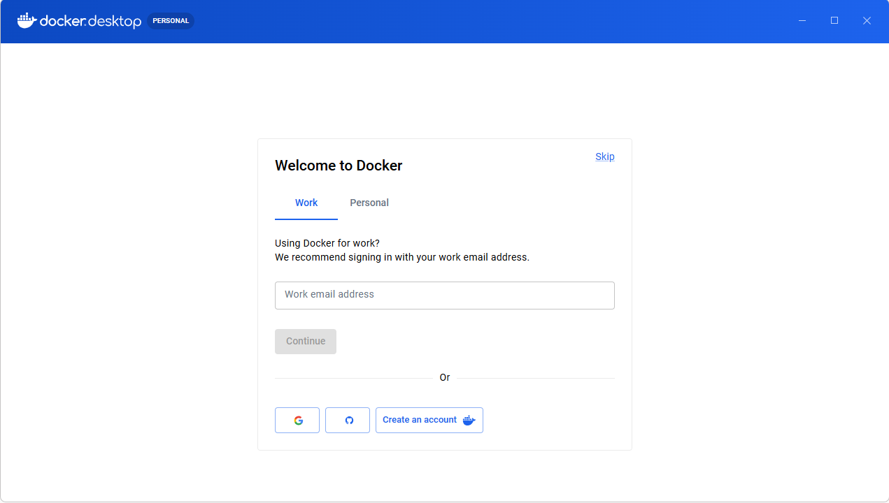
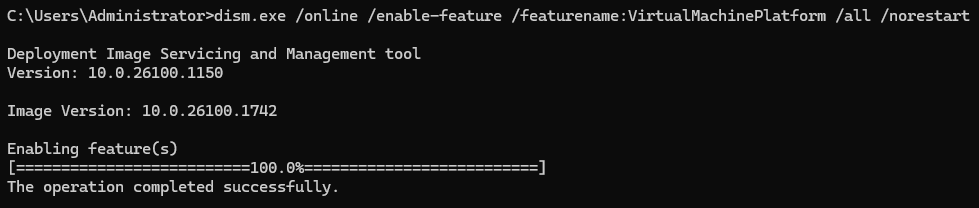
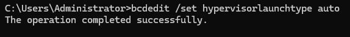
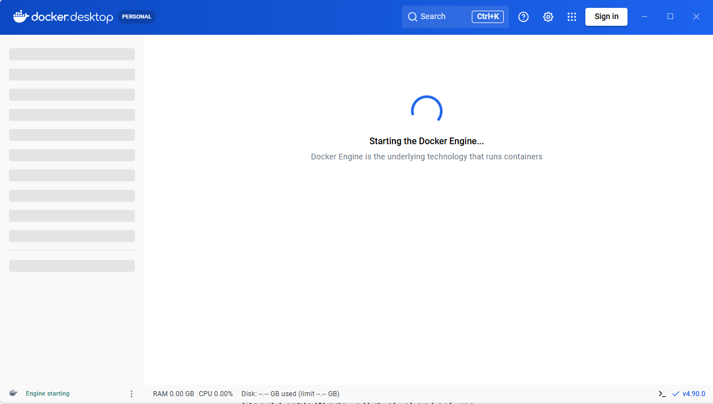

# 1. Prerequisites — WSL 2 and Docker Desktop

TheHive stack runs as Linux containers. On Windows that means WSL 2 plus Docker Desktop using
the WSL 2 backend.

## 1.1 Install WSL 2

In an **Administrator** PowerShell or Command Prompt:

```powershell
wsl --install
```

## 1.2 Install Docker Desktop

Download the **AMD64** installer from [docker.com](https://www.docker.com/products/docker-desktop/).


During installation, tick **Use WSL 2 instead of Hyper-V**. This is what lets the containers
share the WSL 2 kernel instead of running a separate VM.



At the sign-in prompt, click **Skip** — a Docker account is not required for this deployment.



## 1.3 Enable the required Windows features

If WSL 2 or Docker Desktop reports that virtualization is unavailable, enable the platform
features manually. In an **Administrator** Command Prompt:

```cmd
dism.exe /online /enable-feature /featurename:VirtualMachinePlatform /all /norestart
```



```cmd
bcdedit /set hypervisorlaunchtype auto
```



**Reboot the machine** — neither change takes effect until restart.

## 1.4 Verify

Start Docker Desktop and confirm the engine reports **Running** in the bottom-left status bar.



Confirm the Docker CLI is reachable from inside WSL:

```bash
wsl
docker version
```

If `docker version` prints both Client and Server sections, WSL integration is working and you
can continue to [deployment](02-deployment.md).
