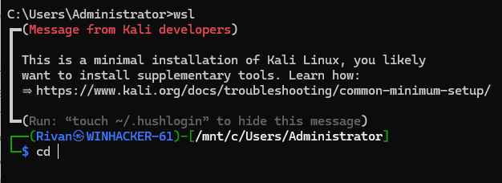
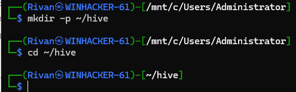
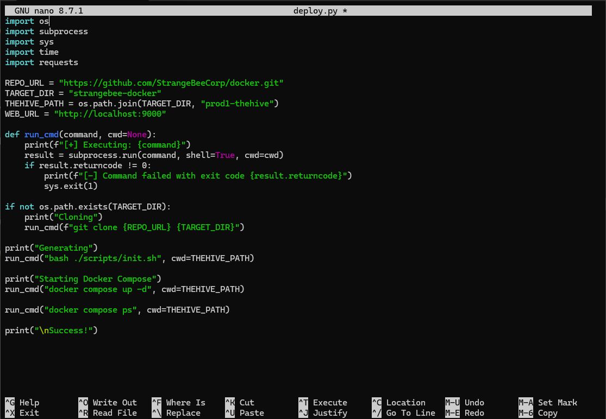
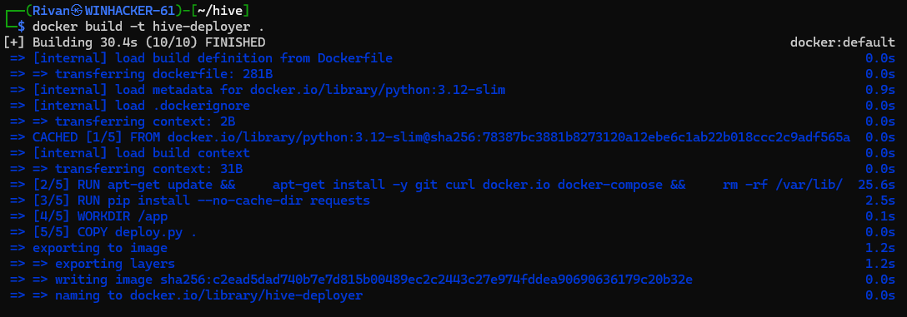
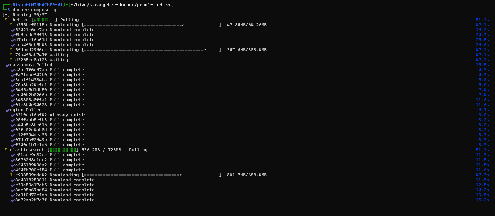
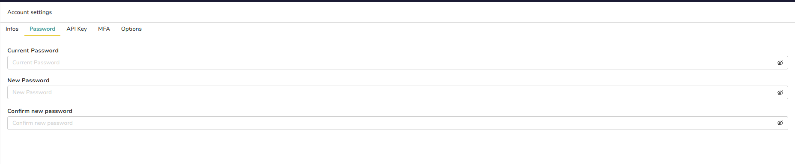

# 2. Deployment

Two paths are documented: the **automated** path (the Python deployer in this repository) and
the **manual** path it wraps. Both produce the same running stack.

## 2.1 Prepare the working directory

Open WSL from a Command Prompt:

```cmd
wsl
```



Create and enter the working directory:

```bash
mkdir -p ~/hive && cd ~/hive
```



Place `src/deploy.py` and `Dockerfile` from this repository here — either by cloning the repo
into `~/hive`, or by recreating them with `nano` as shown below.

```bash
nano deploy.py
```



Save with `Ctrl+O`, `Enter`, then exit with `Ctrl+X`. Repeat for the `Dockerfile`.

## 2.2 What the deployer does

`src/deploy.py` runs four steps and aborts on the first non-zero exit code:

1. Clones `https://github.com/StrangeBeeCorp/docker.git` into `strangebee-docker/` (skipped if
   the directory already exists, so re-runs are safe).
2. Runs `bash ./scripts/init.sh` inside `prod1-thehive/` to generate local secrets and config.
3. Runs `docker compose up -d`.
4. Runs `docker compose ps` so the container states are visible at the end of the run.

## 2.3 Automated path

Build the deployer image:

```bash
docker build -t hive-deployer .
```



The image is `python:3.12-slim` plus `git`, `curl`, and the Docker CLI with the Compose v2
plugin, so it can drive the host's Docker engine.

Run the deployer:

```bash
python3 src/deploy.py    # if you cloned this repository into ~/hive
python3 deploy.py        # if you created the file directly with nano
```

> **Note on running the deployer as a container.** Because `deploy.py` issues `docker compose`
> commands, running it inside a container requires mounting the host Docker socket and the
> working directory:
>
> ```bash
> docker run --rm \
>   -v /var/run/docker.sock:/var/run/docker.sock \
>   -v ~/hive:/app/work -w /app/work \
>   hive-deployer
> ```
>
> Mounting the Docker socket grants the container full control of the host engine. Running
> `deploy.py` directly with `python3` avoids that exposure and is the recommended path.

## 2.4 Manual path

```bash
git clone https://github.com/StrangeBeeCorp/docker.git strangebee-docker
cd strangebee-docker/prod1-thehive
chmod +x scripts/*.sh
./scripts/init.sh
docker compose up -d
```

If the clone was created by a different user or by a container running as root, reclaim
ownership first:

```bash
sudo chown -R "$USER:$USER" ~/hive/strangebee-docker
chmod +x ~/hive/strangebee-docker/prod1-thehive/scripts/*.sh
```

A healthy start looks like this — all services `Up`:



Cassandra and Elasticsearch need roughly a minute before TheHive accepts logins. If the UI
returns a 503 at first, wait and retry.

## 2.5 First login

Browse to:

```
http://localhost:9000/login
```

TheHive's documented first-run defaults are:

| Field | Value |
| --- | --- |
| Username | `admin@thehive.local` |
| Password | `secret` |

**Change the password immediately.** Go to the account menu → **Settings** → **Password**.



Enter `secret` as the current password and set a strong password of your own. Do not reuse a
password that appears in any documentation, including this repository.

Next: [organization and user management](03-user-management.md).
