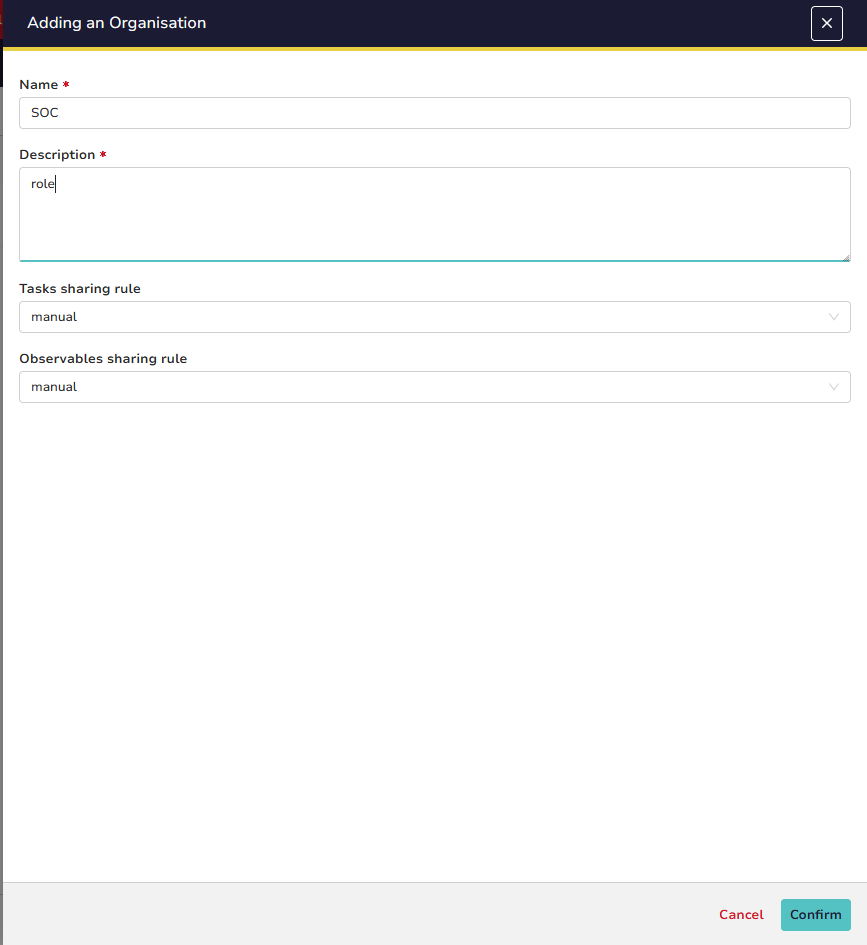
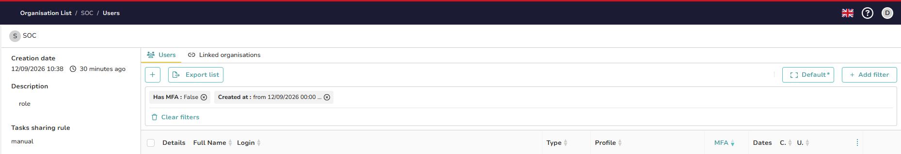
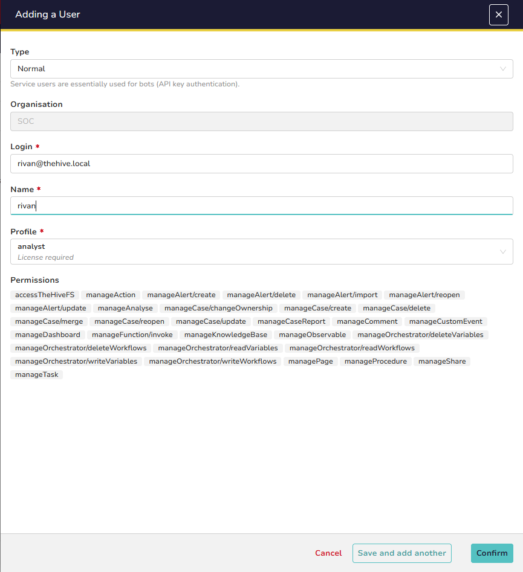
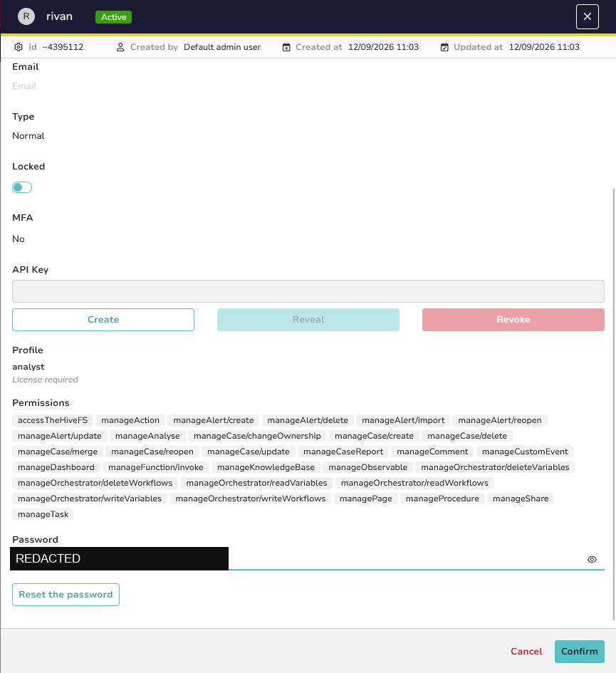
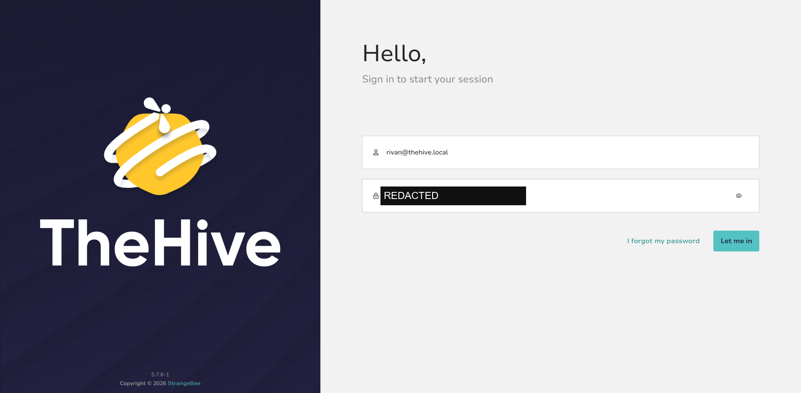
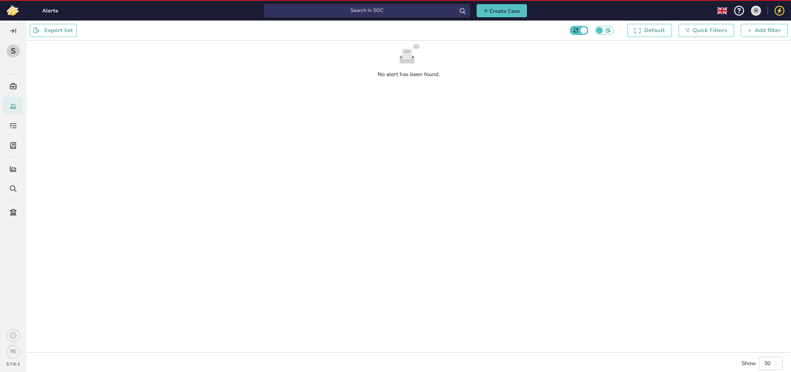

# 3. Organization and user management

TheHive is multi-tenant: cases, observables, and tasks belong to an **organization**. The
built-in `admin` account administers the platform but does not work cases — analysts get their
own accounts inside a dedicated organization.

## 3.1 Create the SOC organization

Sign in as `admin@thehive.local`, open **Organizations**, and create one named `SOC`.

Open it once created.

## 3.2 Add an analyst

Inside the organization, open the **Users** tab and click **Add user**.

Fill in the login, full name, and profile. Use `analyst` for a working SOC analyst — it grants
case and observable handling without organization administration. Reserve `org-admin` for
whoever manages the organization itself.

## 3.3 Set the analyst password

New accounts have no password. Hover the user's row and click the **key / eye** icon in the
password column.

Set a password for the account.

> Set a unique password per analyst and distribute it out of band. Placeholder passwords must
> never be committed to this repository.

## 3.4 Verify least privilege

Log out and sign back in with the analyst credentials.

The analyst lands in the `SOC` organization and can create and work cases, with no access to
platform administration — confirming the separation of duties.

Next: [operations](04-operations.md).
